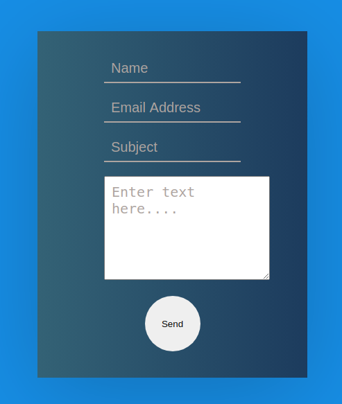

<h1>📪 Email Sender</h1>

This is a contact form created with the use of emailjs.

 

<h1>👩‍💻 Technologies Used</h1>
<ul>
  <li>HTML</li>
  <li>CSS</li>
  <li>EmailJS</li>
  <li>ReactJS</li>
</ul>
 

<h1>💻 Working</h1>

👉🏻 When submitted, the contact form simply emails all the provided information to whatever email address you setup.

 

<h1>🔗 Link</h1>
👉🏻 https://emailsender.netlify.app/
